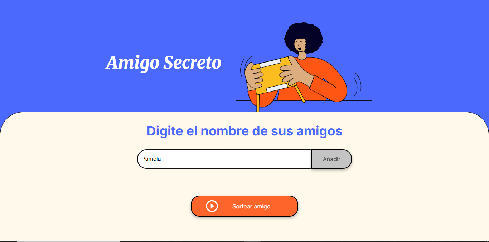

# Descripcion

Este proyecto es la respuesta al desafio de Alura: Amigo Invisible.

## Funcionalidad
El proyecto consiste en gestionar un listado de amigos y que de este listado se seleccione, de forma aleatoria, un nombre de uno de los amigos y que este se muestre mediante un mensaje quien sera el amigo invisible.

## Demostracion de uso
- En la barra ingresar un nombre y para enviarlo apretar el boton "Añadir"

- Apretar el boton "Sortear amigo" para que se selecione uno de los nombres

## Herramientas
- HTML
- JavaScript
- Css